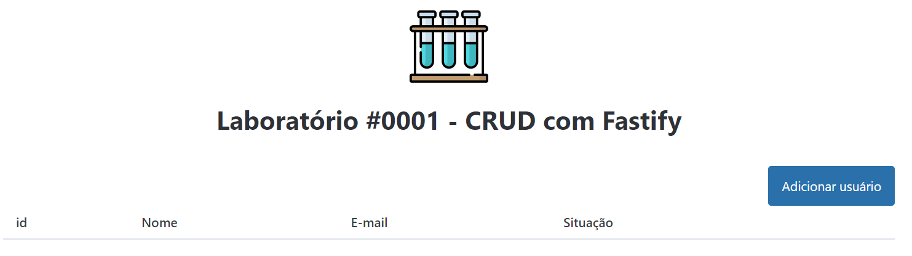
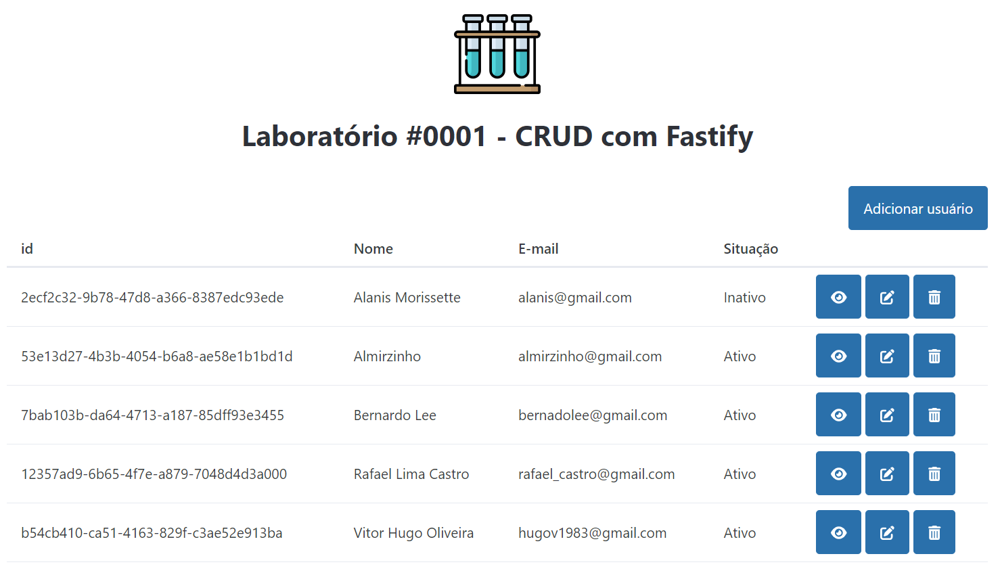
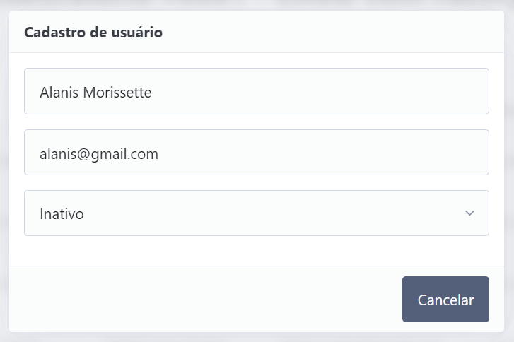
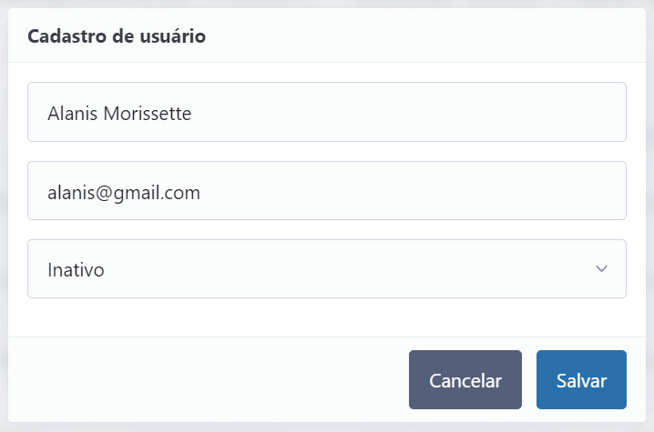
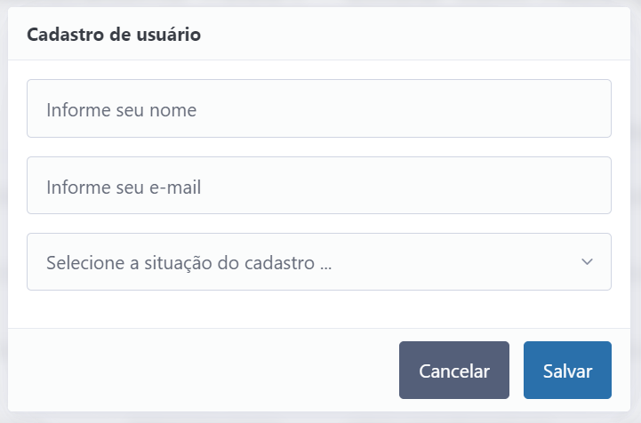
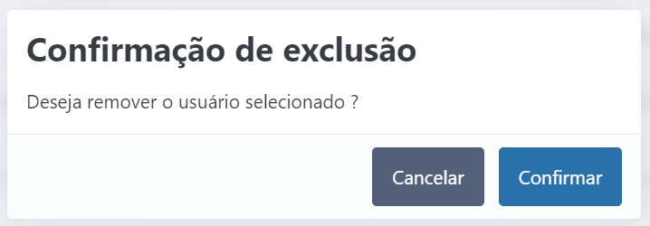

<figure>
    
</figure>

# CRUD com API Fastify

Este é o repositório da POC **CRUD com API Fastify**, criado para analisar o uso do Fastify com um CRUD tradicional.

## O que é o Projeto ?

A ideia do projeto foi construir **CRUD com o uso de API Rest com o framework Fastify** e com isso validar um pedaço de uma aplicação real. Com isso temos uma Proof of Concept Prova de Conceito (POC). 

Foram utilizadas as seguintes tecnologias:
* [HTML](https://developer.mozilla.org/pt-BR/docs/Web/HTML)
* [Pico CSS](https://picocss.com/) 
* [Fastify](https://fastify.dev/)
* [PostgreSQL](https://www.postgresql.org/)

## Serviços disponíveis (endpoints)

Os endpoints disponibilizados por este pacote são os necessários para a implementação de um CRUD.

A lista de endpoints completa está descrita aqui:

* Status  - Serviço que valida se aplicação está no ar.
    * `GET` `/status` : Obtem o status da aplicação
* Usuário - Serviços que apoiam a implementação do CRUD.
    * `GET` `/user` : Lista todos os usuários cadastros na aplicação
    * `GET` `/user/:id` : Obtém o registro do usuário pelo id
    * `POTS` `/user` : Cria o registro de um usuário
    * `PUT` `/user/:id` : Atualiza o registro de um usuário
    * `DELETE` `/user/:id` : Deleta o registro de um usuário pelo id

> Não foram elaboradas nenhuma documentação da API Rest porque foi implementado um protótipo para validar os serviços disponibilizados, com exceção do status.

## Aplicação Web

### Funcionalidade: Cadastro de usuário 

Funcionalidade: Tela inicial da aplicação (Tabela de usuário sem informação)



Funcionalidade: Listagem de usuário



Funcionalidade: Consulta de usuário.



Funcionalidade: Alteração de usuário.



Funcionalidade: Inclusão de usuário.



Funcionalidade: Deleção de usuário



> Para visualizar a aplicação WEB será necessário da Extensão **Live Server** , após ela estar instalada basta pressionar em cima do arquivo **index.html** e pressionar na opção **Open With Live Server**

# Pré-requisitos

* VSCode (Visual Studio Code)
* Instalado e configurado o Docker e o Docker Compose `(Docker version 24.0.5, build ced0996)`
* Node.js 20.11.1
* NPM 10.8.3
* PostgreSQL 16.3 (Caso não tenha instalado use o conatiner do Docker)
* Extensão do VSCode Live Server

# Instalação

Clone o repositório

```
git clone https://github.com/hugov/tubo-ensaio.git
```

Execute o comando

```
npm install
```

## Docker

Com o Docker criaremos um container do banco de dados PostgreSQL 16.3

Execute o comando a seguir, para criar a imagem e subir o container:

```
docker-compose up
```

Caso queira rodar o container em **Backgroud**

```
docker-compose up -d database
```

# Rodando o projeto

Execute o comando

```
npm start
```

# Apoie o projeto

**Tubo de ensaio** é um projeto que visa testar novas tecnológias e disponibilizar o resultado neste repositório. Se você apreciar o nosso rabalho e quiser me pagar um café, sinta-se livre para fazer qualquer doação para a Chave Aleatória Pix `968fc82d-2bef-4046-845c-aebe5dda9d61` ❤.

# Licença

Este projeto está licenciado sob a Licença MIT, ou seja, você pode usá-lo da forma que preferir, incluindo suas próprias modificações em versões próprias.